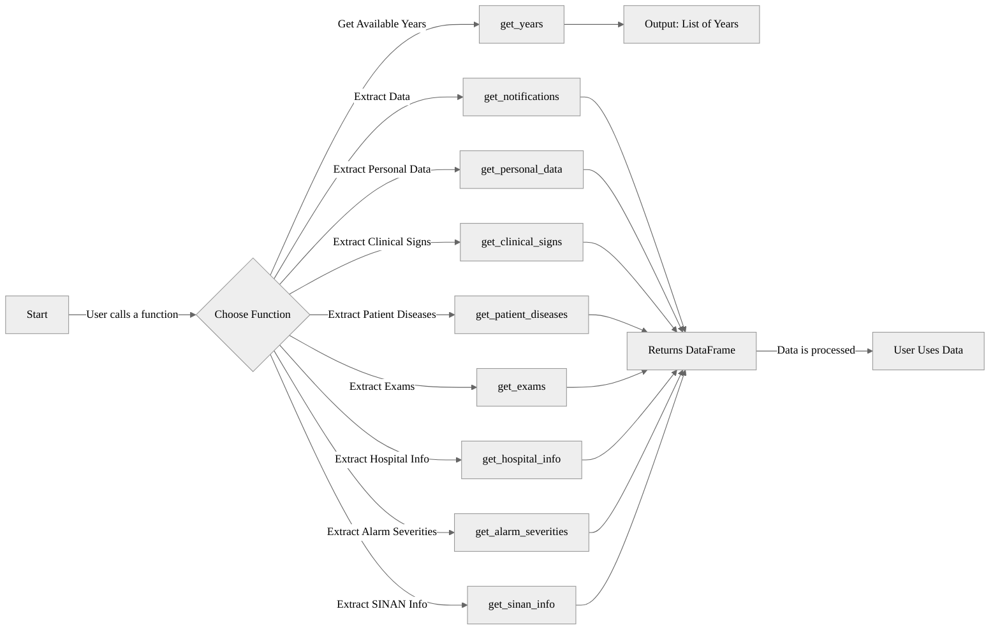

# **PyZDC Functions Flow**

The diagram below illustrates the **workflow of the functions** in PyZDC. It visually represents how different functions interact in the data retrieval process.

1. **User Starts the Process** → The user initiates the workflow by calling a function.

2. **Choosing a Function** → The user selects one of the available functions to fetch epidemiological data.

3. **Functions**:

   - `get_years(disease)` → Retrieves the list of available years for a given disease.

   - `get_notifications(years, disease, limit)` → Fetches notification records for a disease within the specified years.

   - `get_personal_data(years, disease, limit)` → Extracts anonymized personal data of affected individuals.

   - `get_clinical_signs(years, disease, limit)` → Retrieves clinical symptoms related to disease cases.

   - `get_patient_diseases(years, disease, limit)` → Fetches additional diseases present in patient records.

   - `get_exams(years, disease, limit)` → Obtains laboratory test results for reported cases.

   - `get_hospital_info(years, disease, limit)` → Retrieves hospital admission records.

   - `get_alarm_severities(years, disease, limit)` → Fetches cases classified as severe.

   - `get_sinan_info(years, disease, limit)` → Extracts raw SINAN database records.

4. **Data Processing**:

   - If `get_years` is called, it returns a list of years where data is available.

   - If any other function is called, it **fetches data and returns a Pandas DataFrame**.

5. **User Data** → The retrieved data is processed, analyzed, or saved for further use.

For more details, visit: [GitHub Repository](https://github.com/GuttoF/dq-sus).
