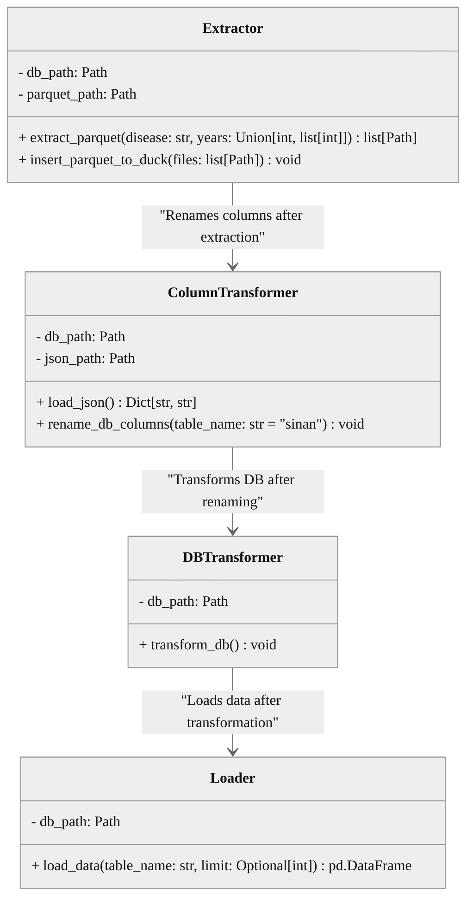

# Class Diagram

```mermaid
%%{init: {"themeVariables": {"fontFamily": "Times New Roman, Times, serif"}}}%%
%%{init: {'theme':'neutral'}}%%
classDiagram
    class Extractor {
        - db_path: Path
        - parquet_path: Path
        + extract_parquet(disease: str, years: Union[int, list[int]]) list[Path]
        + insert_parquet_to_duck(files: list[Path]) void
    }

    class ColumnTransformer {
        - db_path: Path
        - json_path: Path
        + load_json() Dict[str, str]
        + rename_db_columns(table_name: str = "sinan") void
    }

    class DBTransformer {
        - db_path: Path
        + transform_db() void
    }

    class Loader {
        - db_path: Path
        + load_data(table_name: str, limit: Optional[int]) pd.DataFrame
    }

    Extractor --> ColumnTransformer : "Renames columns after extraction"
    ColumnTransformer --> DBTransformer : "Transforms DB after renaming"
    DBTransformer --> Loader : "Loads data after transformation"


```
