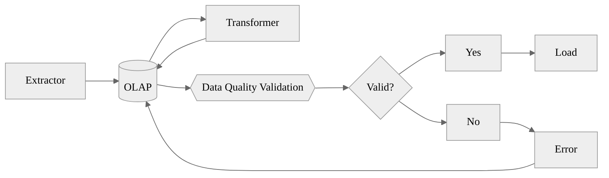

# DQ Diagram

```mermaid
%%{init: {"themeVariables": {"fontFamily": "Times New Roman, Times, serif"}}}%%
%%{init: {'theme':'neutral'}}%%
graph LR
%%Subgraph1[API e CLI]
%%CLI[Command Line Interface] --> Extractor


    Extractor --> DuckDB[(OLAP)]
    DuckDB --> Transformer[Transformer]
    Transformer --> DuckDB[(OLAP)]
    DuckDB --> Pandera{{Data Quality Validation}}
    Pandera --> OK{Valid?}
    OK --> Yes --> Load
    OK --> No --> Error --> DuckDB


```
