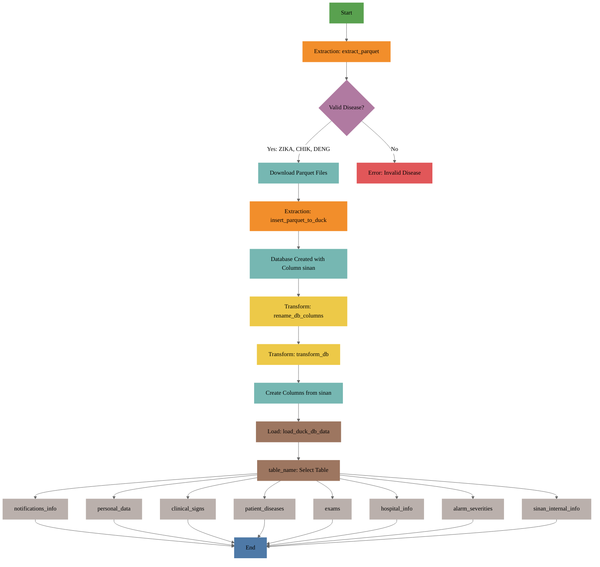

# Flowchart

```mermaid
%%{init: {"themeVariables": {"fontFamily": "Times New Roman, Times, serif"}}}%%
%%{init: {'theme':'neutral'}}%%
graph TD
    A[Start] --> B[Extraction: extract_parquet]
    B --> C{Valid Disease?}
    C -->|Yes: ZIKA, CHIK, DENG| D[Download Parquet Files]
    C -->|No| E[Error: Invalid Disease]
    D --> F[Extraction: insert_parquet_to_duck]
    F --> G[Database Created with Column sinan]
    G --> H[Transform: rename_db_columns]
    H --> I[Transform: transform_db]
    I --> J[Create Columns from sinan]
    J --> K1[Load: load_duck_db_data]
    K1 --> K2[table_name: Select Table]
    K2 --> L1[notifications_info] --> M[End]
    K2 --> L2[personal_data] --> M
    K2 --> L3[clinical_signs] --> M
    K2 --> L4[patient_diseases] --> M
    K2 --> L5[exams] --> M
    K2 --> L6[hospital_info] --> M
    K2 --> L7[alarm_severities] --> M
    K2 --> L8[sinan_internal_info] --> M

    style A fill:#59A14F,stroke:#59A14F,stroke-width:2px
    style B fill:#F28E2B,stroke:#F28E2B,stroke-width:2px
    style C fill:#B07AA1,stroke:#B07AA1,stroke-width:2px
    style D fill:#76B7B2,stroke:#76B7B2,stroke-width:2px
    style E fill:#E15759,stroke:#E15759,stroke-width:2px
    style F fill:#F28E2B,stroke:#F28E2B,stroke-width:2px
    style G fill:#76B7B2,stroke:#76B7B2,stroke-width:2px
    style H fill:#EDC948,stroke:#EDC948,stroke-width:2px
    style I fill:#EDC948,stroke:#EDC948,stroke-width:2px
    style J fill:#76B7B2,stroke:#76B7B2,stroke-width:2px
    style K1 fill:#9D7660,stroke:#9D7660,stroke-width:2px
    style K2 fill:#9D7660,stroke:#9D7660,stroke-width:2px
    style L1 fill:#BAB0AC,stroke:#BAB0AC,stroke-width:2px
    style L2 fill:#BAB0AC,stroke:#BAB0AC,stroke-width:2px
    style L3 fill:#BAB0AC,stroke:#BAB0AC,stroke-width:2px
    style L4 fill:#BAB0AC,stroke:#BAB0AC,stroke-width:2px
    style L5 fill:#BAB0AC,stroke:#BAB0AC,stroke-width:2px
    style L6 fill:#BAB0AC,stroke:#BAB0AC,stroke-width:2px
    style L7 fill:#BAB0AC,stroke:#BAB0AC,stroke-width:2px
    style L8 fill:#BAB0AC,stroke:#BAB0AC,stroke-width:2px
    style M fill:#4E79A7,stroke:#4E79A7,stroke-width:2px

```
