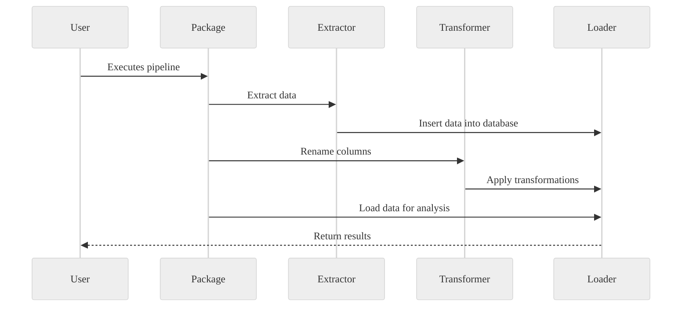

# Sequence Diagram

```mermaid
%%{init: {"themeVariables": {"fontFamily": "Times New Roman, Times, serif"}}}%%
%%{init: {'theme':'neutral'}}%%
sequenceDiagram
    participant User as User
    participant CLI as Package
    participant Extractor as Extractor
    participant Transformer as Transformer
    participant DB as Loader

    User->>CLI: Executes pipeline
    CLI->>Extractor: Extract data
    Extractor->>DB: Insert data into database
    CLI->>Transformer: Rename columns
    Transformer->>DB: Apply transformations
    CLI->>DB: Load data for analysis
    DB-->>User: Return results


```
