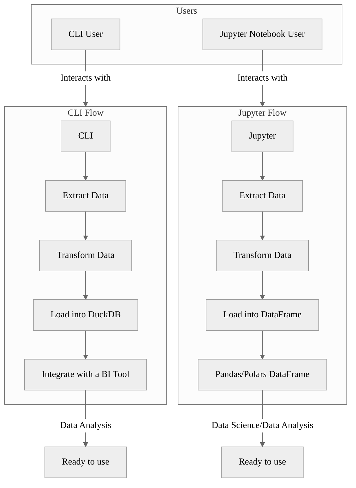

# User Diagram

```mermaid
%%{init: {"themeVariables": {"fontFamily": "Times New Roman, Times, serif"}}}%%
%%{init: {'theme':'neutral'}}%%
flowchart TD
    subgraph Users ["Users"]
        CLIUser["CLI User"]
        NotebookUser["Jupyter Notebook User"]
    end

    subgraph CLIFlow ["CLI Flow"]
        CLI[CLI] --> ExtractorCLI["Extract Data"]
        ExtractorCLI --> TransformerCLI["Transform Data"]
        TransformerCLI --> LoaderCLI["Load into DuckDB"]
        LoaderCLI --> ResultCLI["Integrate with a BI Tool"]
    end

    subgraph NotebookFlow ["Jupyter Flow"]
        Notebook["Jupyter"] --> ExtractorNB["Extract Data"]
        ExtractorNB --> TransformerNB["Transform Data"]
        TransformerNB --> LoaderNB["Load into DataFrame"]
        LoaderNB --> DataFrame["Pandas/Polars DataFrame"]
    end

    CLIUser -->|Interacts with| CLIFlow
    NotebookUser -->|Interacts with| NotebookFlow

    ResultCLI -->|Data Analysis| AnalyzeCLI["Ready to use"]
    DataFrame -->|Data Science/Data Analysis| AnalyzeNB["Ready to use"]


```
