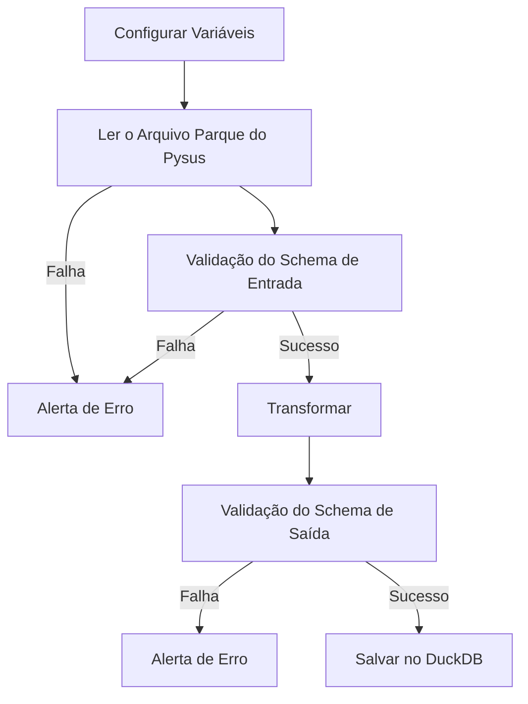

# Data Quality SUS

## Data Quality Extraction Process

```mermaid
graph TD
    A[Configurar Variáveis] --> B[Ler o Arquivo Parque do Pysus];
    B --> V[Validação do Schema de Entrada];
    B --> |Falha| X[Alerta de Erro];
    V --> |Falha| X[Alerta de Erro];
    V --> |Sucesso| C[Transformar];
    C --> Y[Validação do Schema de Saída];
    Y --> |Falha| Z[Alerta de Erro];
    Y --> |Sucesso| D[Salvar no DuckDB];
```

# Contrato de dados
::: src.etl.extraction
